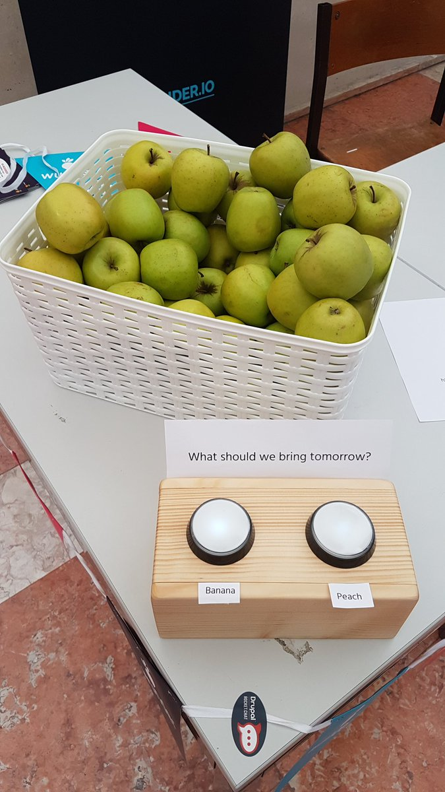

# Voting App
This repository contains our voting device's prototyping source code
made on top of [Mongoose OS](https://mongoose-os.com/).

This is made for Drupal Dev Days 2018 Lisbon event. Meet us at the
booth or at the event.

# Changelog

## Version 1: Tuesday
* First version
* Has button fading visualisation feature indicating standby state
* Has blinking feature for indicating request send
* Sends a request of the votes to Drupal installation

## Version 2: Wednesday morning
* Fixed interfering visualisation when by pressing buttons too fast
* Improved standby visualisation starting state for more intuitive UX
* New vote: Banana vs Peach
* If request fails for any reason, just try again (at least 3 tries)
